<!-- Florian Monnier. Profil GitHub. Visuels : /assets (SVG versionnés, générés par script). -->

 

## &nbsp;Qui je suis

Je développe des logiciels sur mesure et j'automatise des processus : applications métiers, sites web, scripts et intégrations qui font disparaître les tâches répétitives.

Diplômé de la Faculté de droit et de science politique d'Aix-Marseille Université, spécialisation droit du numérique et compliance. Formé au développement à 42 Marseille. Quatre ans comme clerc en étude de commissaire de justice.

Je connais le métier de l'intérieur : les délais, la traçabilité, le secret professionnel. Je traite la confidentialité et la conservation des données comme des contraintes de conception, dès la première ligne de spécification.

 

## &nbsp;Gavroche Solutions

**[gavrochesolutions.fr](https://gavrochesolutions.fr)** : développement et automatisation sur mesure, région Aix-Marseille.

Le point de départ est toujours le même : quelqu'un passe deux heures par semaine à recopier des données d'un outil vers un autre, ou à reconstruire le même document à la main. Le livrable, c'est le temps récupéré.

Nous intervenons en priorité auprès des professions du droit : avocats, notaires, commissaires de justice, mandataires judiciaires. Un secteur où le secret professionnel, les délais de forclusion et la traçabilité ne sont pas des options de configuration.

**Reprendre la main sur votre infrastructure.** Nous accompagnons la transition vers Linux et les solutions open source françaises et européennes : postes de travail Linux, Nextcloud pour le stockage et le partage, OnlyOffice ou Collabora pour la bureautique, Mailcow ou Zimbra pour la messagerie, CRM et outils de gestion open source. Hébergement sur site, chez un hébergeur français ou européen, ou sur un serveur dédié que nous administrons. Vos données restent sous droit européen, conformes au RGPD.

 

## &nbsp;Études de cas

L'essentiel de notre travail est réalisé sous contrat, dans des dépôts privés. Code et démonstrations présentés en entretien.

 

## &nbsp;Ce que nous construisons

 

## &nbsp;Méthode

> *« La conformité n'est pas une fonctionnalité qu'on ajoute à la fin. C'est une décision d'architecture qu'on prend au début. »*

Je conçois des systèmes où les exigences sont explicites, le comportement prévisible, et où les journaux et la documentation font partie du livrable. Le droit m'a appris à raisonner en obligations, en traçabilité et en risque. Le développement, c'est là où ça devient du code.

Appliqué à un cabinet, ça donne une règle non négociable : **les données du client restent chez le client.** Le confort n'achète jamais une dérogation à la confidentialité.

 

## &nbsp;Technologies

| Domaine | Technologies |
|:--|:--|
| **Langages** | Python, TypeScript, JavaScript, C, Bash, SQL |
| **Back-end** | FastAPI, SQLAlchemy, Node.js, API REST, webhooks |
| **Front-end** | React, Vite, Tailwind CSS |
| **Données** | PostgreSQL, SQLite |
| **Infrastructure** | Debian, Linux, Docker, Nginx, WireGuard |
| **Sécurité** | Durcissement SSH, CrowdSec, Vaultwarden, AdGuard Home, SPF / DKIM / DMARC |
| **Open source souverain** | Nextcloud, OnlyOffice / Collabora, Mailcow / Zimbra, CRM et outils de gestion, postes de travail Linux |
| **Intégrations** | Microsoft Graph, Google Apps Script |
| **Outils** | Git, VS Code |

 

## &nbsp;Activité

<!-- Les dépôts privés comptent SI l'option est activée sur le profil GitHub :               -->
<!-- Settings → Profile → Contributions & Activity → « Include private contributions ».       -->

<!-- Serpent de contributions : généré par .github/workflows/snake.yml (Platane/snk) sur la  -->
<!-- branche « output ». Premier rendu au premier passage du workflow après fusion sur main. -->

  

<!-- Calendrier de contributions : rendu SVG direct, sans quota partagé. -->

<!-- Statistiques incluant les dépôts privés : .github/workflows/metrics.yml (désactivé tant que la
     variable METRICS_ENABLED n'est pas posée). Une fois activé, décommenter :

&nbsp;

-->

 

## &nbsp;En ce moment

 

## &nbsp;Me contacter

Vous avez une tâche que quelqu'un refait à la main toutes les semaines ? Parlons-en.

&nbsp;
&nbsp;
&nbsp;

 

  

