<!-- Florian Monnier. Profil GitHub. Visuels : /assets (SVG versionnés, générés par script). -->

 

## &nbsp;Qui je suis

Je développe des logiciels sur mesure et j'automatise des processus : applications métiers, sites web, scripts et intégrations qui font disparaître les tâches répétitives.

Diplômé de la Faculté de droit et de science politique d'Aix-Marseille Université, spécialisation droit du numérique et compliance. Formé au développement à 42 Marseille. Quatre ans comme clerc en étude de commissaire de justice.

Je connais le métier de l'intérieur : les délais, la traçabilité, le secret professionnel. Je traite la confidentialité et la conservation des données comme des contraintes de conception, dès la première ligne de spécification.

 

## &nbsp;Gavroche Solutions

**[gavrochesolutions.fr](https://gavrochesolutions.fr)** : développement et automatisation sur mesure, région Aix-Marseille.

Le point de départ est toujours le même : quelqu'un passe deux heures par semaine à recopier des données d'un outil vers un autre, ou à reconstruire le même document à la main. Le livrable, c'est le temps récupéré.

Nous intervenons en priorité auprès des professions du droit : avocats, notaires, commissaires de justice, mandataires judiciaires. Un secteur où le secret professionnel, les délais de forclusion et la traçabilité ne sont pas des options de configuration.

**Reprendre la main sur votre infrastructure.** Nous accompagnons la transition vers Linux et les solutions open source françaises et européennes : postes de travail Linux, Nextcloud pour le stockage et le partage, OnlyOffice ou Collabora pour la bureautique, Mailcow ou Zimbra pour la messagerie, CRM et outils de gestion open source. Hébergement sur site, chez un hébergeur français ou européen, ou sur un serveur dédié que nous administrons. Vos données restent sous droit européen, conformes au RGPD.

 

## &nbsp;Vous vous reconnaissez ?

Si vous lisez cette page, vous avez probablement cherché une réponse à l'une de ces situations.

**Windows 10 n'est plus maintenu depuis le 14 octobre 2025.** Vos postes tournent encore dessus, Windows 11 refuse une partie des machines et renouveler le parc coûte cher. Nous migrons vos postes vers Linux, avec la bureautique et la messagerie qui vont avec. Les machines existantes repartent pour plusieurs années.

**Vos données sont chez un hébergeur soumis au droit américain.** En juin 2025, devant une commission d'enquête du Sénat, Microsoft France a reconnu ne pas pouvoir garantir que des données hébergées en France ne seraient jamais transmises aux autorités américaines. Pour une étude ou un cabinet tenu au secret professionnel, la question ne se pose plus. Nous rapatrions fichiers, agendas et messagerie sur Nextcloud et des solutions open source, hébergés sur site ou chez un hébergeur français ou européen.

**La facturation électronique devient obligatoire.** Depuis le 1er septembre 2026, toutes les entreprises doivent pouvoir recevoir des factures électroniques ; l'obligation d'émission s'étend aux PME en septembre 2027. Nous connectons votre logiciel de gestion à une plateforme agréée et automatisons la génération et l'envoi.

**Les rançongiciels visent les cabinets et les études.** Les professions du droit concentrent des données sensibles et des délais impératifs : une étude paralysée trois jours perd des actes. Nous durcissons vos serveurs, mettons en place des sauvegardes testées et un accès distant par VPN.

**Vos équipes recopient des données d'un logiciel à l'autre.** Le logiciel métier ne fait pas tout ; les tableurs et le copier-coller comblent les trous, avec les erreurs qui vont avec. Nous développons l'outil qui manque et l'intégrons à l'existant. Synergie Tools est né comme ça.

**NIS 2 et le RGPD élargissent vos obligations.** La transposition de la directive NIS 2 étend les exigences de cybersécurité à des milliers d'entités, et la CNIL contrôle. Nous concevons avec la conformité dès le départ : journaux, traçabilité, conservation. C'est le sens de ma formation en droit du numérique.

 

## &nbsp;Études de cas

L'essentiel de notre travail est réalisé sous contrat, dans des dépôts privés. Code et démonstrations présentés en entretien.

 

## &nbsp;Ce que nous construisons

 

## &nbsp;Méthode

> *« La conformité n'est pas une fonctionnalité qu'on ajoute à la fin. C'est une décision d'architecture qu'on prend au début. »*

Je conçois des systèmes où les exigences sont explicites, le comportement prévisible, et où les journaux et la documentation font partie du livrable. Le droit m'a appris à raisonner en obligations, en traçabilité et en risque. Le développement, c'est là où ça devient du code.

Appliqué à un cabinet, ça donne une règle non négociable : **les données du client restent chez le client.** Le confort n'achète jamais une dérogation à la confidentialité.

 

## &nbsp;Technologies

| Domaine | Technologies |
|:--|:--|
| **Langages** | &nbsp;Python &nbsp;·&nbsp; &nbsp;TypeScript &nbsp;·&nbsp; &nbsp;JavaScript &nbsp;·&nbsp; &nbsp;C &nbsp;·&nbsp; &nbsp;Bash &nbsp;·&nbsp; &nbsp;SQL |
| **Back-end** | &nbsp;FastAPI &nbsp;·&nbsp; &nbsp;SQLAlchemy &nbsp;·&nbsp; &nbsp;Node.js &nbsp;·&nbsp; API REST &nbsp;·&nbsp; webhooks |
| **Front-end** | &nbsp;React &nbsp;·&nbsp; &nbsp;Vite &nbsp;·&nbsp; &nbsp;Tailwind CSS |
| **Données** | &nbsp;PostgreSQL &nbsp;·&nbsp; &nbsp;SQLite |
| **Infrastructure** | &nbsp;Debian &nbsp;·&nbsp; &nbsp;Linux &nbsp;·&nbsp; &nbsp;Docker &nbsp;·&nbsp; &nbsp;Nginx &nbsp;·&nbsp; &nbsp;WireGuard |
| **Sécurité** | &nbsp;Durcissement SSH &nbsp;·&nbsp; CrowdSec &nbsp;·&nbsp; &nbsp;Vaultwarden &nbsp;·&nbsp; &nbsp;AdGuard Home &nbsp;·&nbsp; SPF / DKIM / DMARC |
| **Open source souverain** | &nbsp;Nextcloud &nbsp;·&nbsp; &nbsp;OnlyOffice &nbsp;·&nbsp; Collabora &nbsp;·&nbsp; Mailcow / Zimbra &nbsp;·&nbsp; CRM et outils de gestion &nbsp;·&nbsp; &nbsp;Postes de travail Linux |
| **Intégrations** | Microsoft Graph &nbsp;·&nbsp; Google Apps Script |
| **Outils** | &nbsp;Git &nbsp;·&nbsp; VS Code |

 

## &nbsp;Activité

<!-- Calendrier rendu par scripts/contributions.py via .github/workflows/contributions.yml (chaque nuit -->
<!-- et à chaque fusion sur main). Les dépôts privés comptent si l'option est activée sur le profil : -->
<!-- Settings → Profile → Contributions & Activity → « Include private contributions ».             -->

 

<!-- Statistiques incluant les dépôts privés : .github/workflows/metrics.yml (désactivé tant que la
     variable METRICS_ENABLED n'est pas posée). Une fois activé, décommenter :

&nbsp;

-->

 

## &nbsp;En ce moment

 

## &nbsp;Me contacter

Vous avez une tâche que quelqu'un refait à la main toutes les semaines ? Parlons-en.

&nbsp;
&nbsp;
&nbsp;

 

  

