<!-- ╔══════════════════════════════════════════════════════════════╗ -->
<!-- ║  Florian Monnier — GitHub Profile README                    ║ -->
<!-- ║  Droit × Code × Automatisation                              ║ -->
<!-- ║  Composants animés : /assets (SVG versionnés, sans tiers)   ║ -->
<!-- ╚══════════════════════════════════════════════════════════════╝ -->

<!-- Typing SVG — sous-titre animé -->

<!-- Trois piliers animés -->

  

<!-- Badges — identité en un coup d'œil -->

  

&nbsp;

<!-- ═══════════════════════════════════════════════════ -->
<!-- SECTION : QUI JE SUIS                              -->
<!-- ═══════════════════════════════════════════════════ -->

## &nbsp;Qui je suis

Je développe des logiciels sur mesure et j'automatise des processus. Concrètement : des **sites web**, des **applications métiers**, des **scripts et intégrations** qui font disparaître les tâches répétitives.

Le point de départ est toujours le même — quelqu'un passe deux heures par semaine à recopier des données d'un outil vers un autre, ou à reconstruire le même document à la main. Le livrable, c'est le temps récupéré.

J'ai un **diplôme de droit, spécialisation droit du numérique et RGPD**, et je suis étudiant à **42 Marseille**. Cette double formation n'est pas décorative : elle me sert à traiter la confidentialité, la traçabilité et la conservation des données comme des contraintes de conception, dès la première ligne de spec.

<!-- ═══════════════════════════════════════════════════ -->
<!-- SECTION : GAVROCHE SOLUTIONS                       -->
<!-- ═══════════════════════════════════════════════════ -->

## &nbsp;Gavroche Solutions

**[gavrochesolutions.fr](https://gavrochesolutions.fr)** — développement et automatisation sur mesure, région Aix-Marseille.

 

  

Une spécialisation : les **professions du droit** — avocats, notaires, commissaires de justice, mandataires judiciaires. Un secteur où le secret professionnel, les délais de forclusion et la traçabilité ne sont pas des options de configuration.

> **Je développe des outils. Je ne délivre pas de conseil juridique.** Le diplôme explique pourquoi je comprends les contraintes du métier — il ne constitue pas une offre de prestation juridique.

<!-- ═══════════════════════════════════════════════════ -->
<!-- SECTION : ÉTUDE DE CAS                             -->
<!-- ═══════════════════════════════════════════════════ -->

## &nbsp;Étude de cas

 

  
L'essentiel de mon travail est réalisé sous contrat, dans des dépôts privés — c'est la contrepartie d'une clientèle tenue au secret professionnel.

<!-- ═══════════════════════════════════════════════════ -->
<!-- SECTION : CE QUE JE CONSTRUIS                      -->
<!-- ═══════════════════════════════════════════════════ -->

## &nbsp;Ce que je construis

<table>
<tr>

<td align="center" width="33%">
 
  
<b>Outils internes & web</b> 
Interfaces sur mesure · portails FastAPI · React · Node.js · PostgreSQL · Docker Authentification · rôles · journalisation  
</td>

<td align="center" width="33%">
 
  
<b>Traitements & intégrations</b> 
Python · Bash · API REST Génération documentaire · synchronisations Traitements par lots · alertes  
</td>

<td align="center" width="33%">
 
  
<b>Walpole — serveur autohébergé</b> 
Debian 12 bare metal · WireGuard AdGuard Home · Vaultwarden CrowdSec · SSH durci  
</td>

</tr>
</table>

<!-- ═══════════════════════════════════════════════════ -->
<!-- SECTION : MÉTHODE                                  -->
<!-- ═══════════════════════════════════════════════════ -->

## &nbsp;Méthode

> *« La conformité n'est pas une fonctionnalité qu'on ajoute à la fin — c'est une décision d'architecture qu'on prend au début. »*

Je conçois des systèmes où les **exigences sont explicites**, le **comportement est prévisible**, et où les **logs et la documentation font partie du livrable**. Le droit m'a appris à raisonner en obligations, en traçabilité et en risque ; le développement, c'est là où ça devient du code.

Appliqué à un cabinet, ça donne une règle non négociable : **les données du client restent chez le client.** Le confort n'achète jamais une dérogation à la confidentialité.

 

 

<!-- ═══════════════════════════════════════════════════ -->
<!-- SECTION : STACK                                    -->
<!-- ═══════════════════════════════════════════════════ -->

## &nbsp;Technologies

 

  

| Domaine | Technologies |
|:--|:--|
| **Langages** |       |
| **Web & applications** |        |
| **Bases de données** |    |
| **Intégrations & API** |     |
| **Infrastructure** |    |
| **Sécurité** |     |
| **Outils** |   |

 

<!-- ═══════════════════════════════════════════════════ -->
<!-- SECTION : ACTIVITÉ                                 -->
<!-- ═══════════════════════════════════════════════════ -->

## &nbsp;Activité

 

<!-- Série de contributions — instance demolab (l'ancien hôte herokuapp est mort).      -->
<!-- Compte aussi les dépôts privés SI l'option est activée sur le profil GitHub :      -->
<!-- Settings → Profile → Contributions & Activity → « Include private contributions ». -->

  

<!-- ┌─ STATS AVEC DÉPÔTS PRIVÉS ──────────────────────────────────────────────┐
     │ Le widget « top-langs » de github-readme-stats ne compte que les dépôts  │
     │ PUBLICS (instance publique, quota partagé) : tous mes dépôts de code     │
     │ étant privés, il s'affichait vide. Remplacement prêt à l'emploi :        │
     │ .github/workflows/metrics.yml génère les images ci-dessous avec un jeton │
     │ personnel (dépôts privés compris). Suivre les étapes d'activation en     │
     │ tête du workflow, puis décommenter ce bloc.                              │
     └──────────────────────────────────────────────────────────────────────────┘

&nbsp;

-->

<!-- ═══════════════════════════════════════════════════ -->
<!-- SECTION : EN CE MOMENT                             -->
<!-- ═══════════════════════════════════════════════════ -->

## &nbsp;En ce moment

 

 

<!-- ═══════════════════════════════════════════════════ -->
<!-- SECTION : CONTACT                                  -->
<!-- ═══════════════════════════════════════════════════ -->

## &nbsp;Me contacter

Ouvert aux collaborations autour du **développement sur mesure**, de l'**automatisation de processus** et de la **gouvernance open source**. Si vous avez une tâche que quelqu'un refait à la main toutes les semaines — parlons-en.

 

&nbsp;&nbsp;

&nbsp;&nbsp;

&nbsp;&nbsp;

  

<!-- Vague de pied de page -->

